# LetsPPT
AI自动生成PPT文档的Java应用，一个标题生成PPT模板。

项目代码包含：

- 标注系统（Java）
- 生成系统（Java）
- 生成后人工审核系统（Java）
- C端前端页面（PHP，原生html，自适应）
- 标注端前端（PHP，原生html）
- 审核端前端（PHP，原生html）
- 登录端小程序（原生微信小程序）

**和AI生成LOGO类似，本质就是套模板的随机生成，和 AI画图、文本生成并不相同。**

因为POI对2010版本PPT特性支持太差，我直接写了个Java原生生成PPT的jar工具包，开源官网在：[PPTShow官网](https://pptshow.cc/) 欢迎点个Star支持下！
   
    
## 🔥需要我的免费帮助吗

如果您**能够提供符合以下条件的内推帮助**，您可以直接添加我的私人微信 iamqrp 咨询，备注：letsppt（**我有一个朋友可能需要您的帮助**)：

1. **工作的组确认没有酒桌文化（必须）**；
2. 英语水平要求不高；
3. **江浙沪的大厂/独角兽公司** 或 **非国企的wlb工作** 或 **提供工签的海外机会**
     
------
     
如果您不能提供，您依然可以通过邮件联系，**每周末会处理一次**，工作邮箱：qiruipeng@88.com

      

## 直观感受

### 生成的PPT

不仅PPT，这个视频也是自动生成的：

https://user-images.githubusercontent.com/53297393/245331343-43c1cd94-e3b3-41d2-9efa-93b4a7cad0a7.mp4

### 前端页面

C端新用户弹窗

PPT展示单页

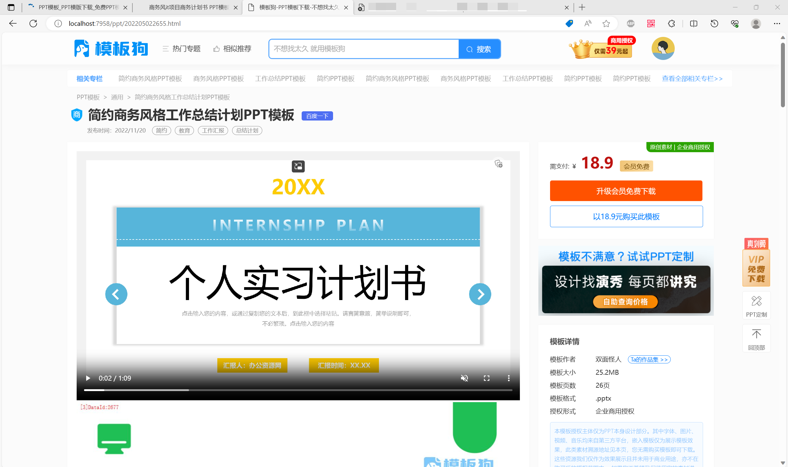

Tag关键词页

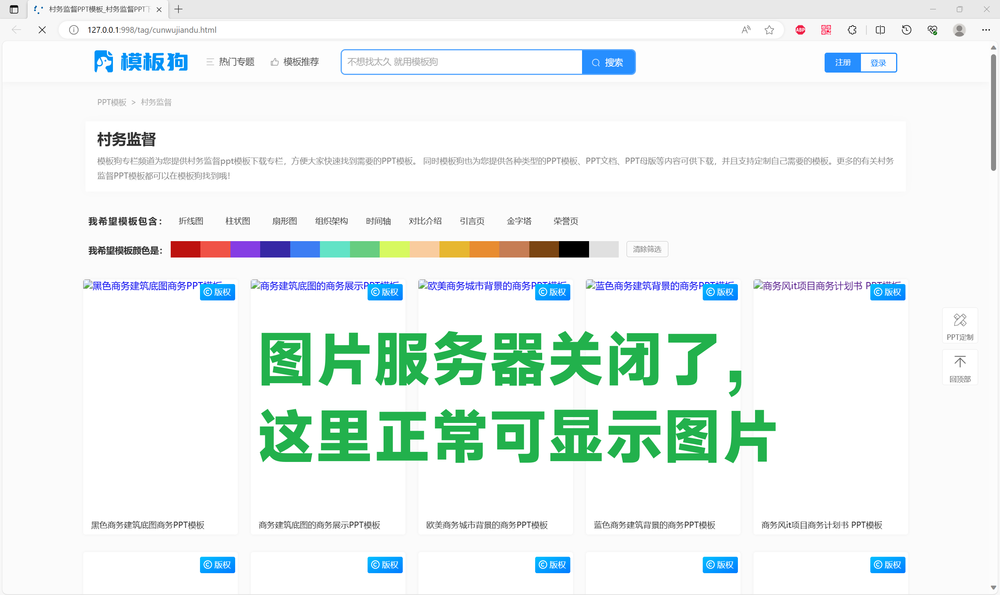

小程序扫码登录

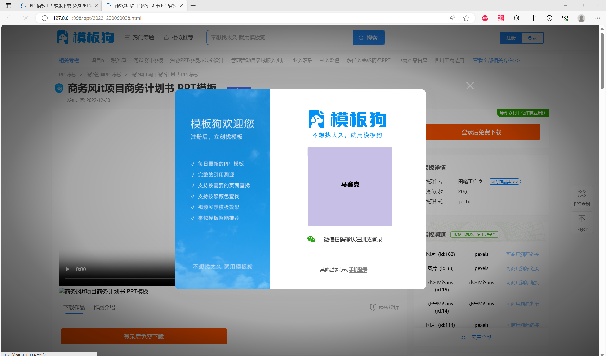

手机验证码绑定（支持小程序扫码后依旧强制绑定手机号）

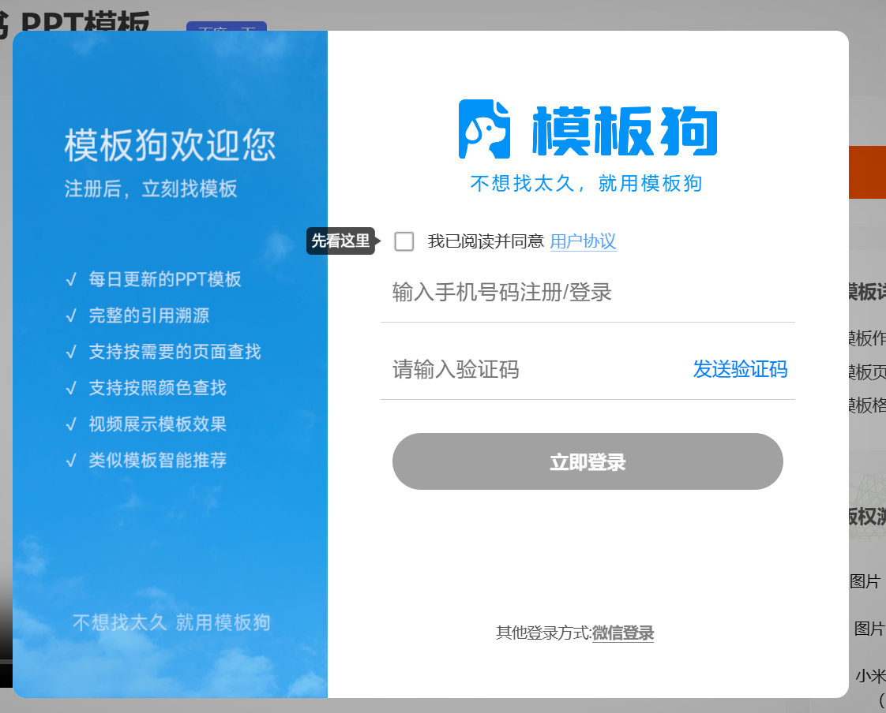

用户协议文本页面

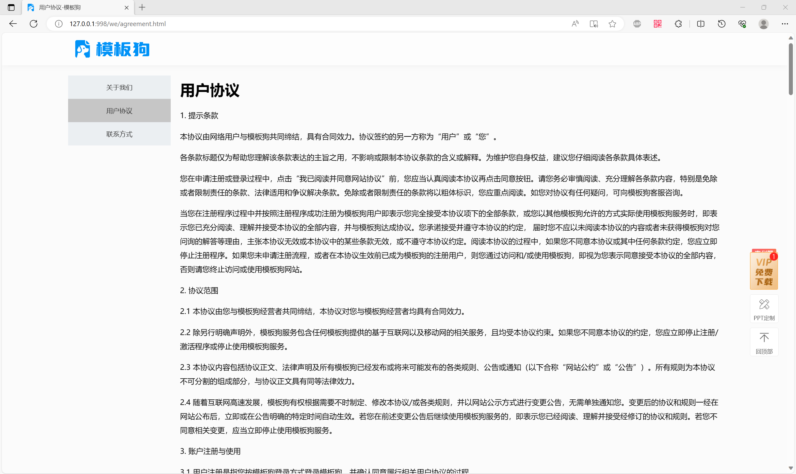

会员开通付款页面

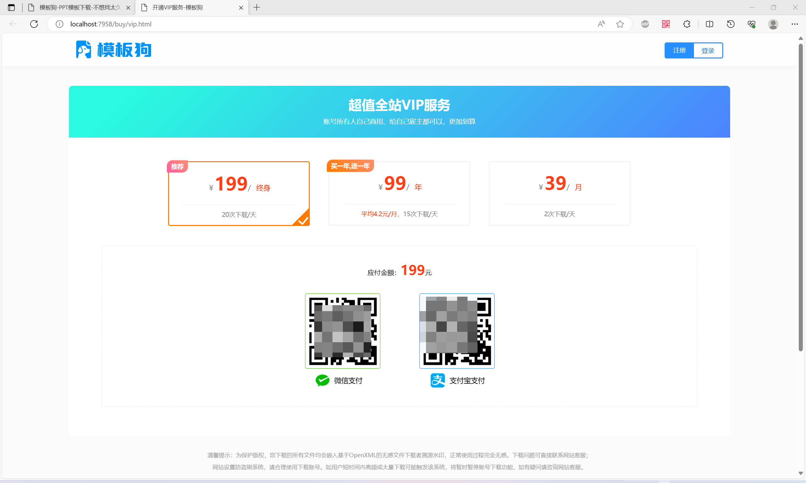

SEO友好的动态面包屑

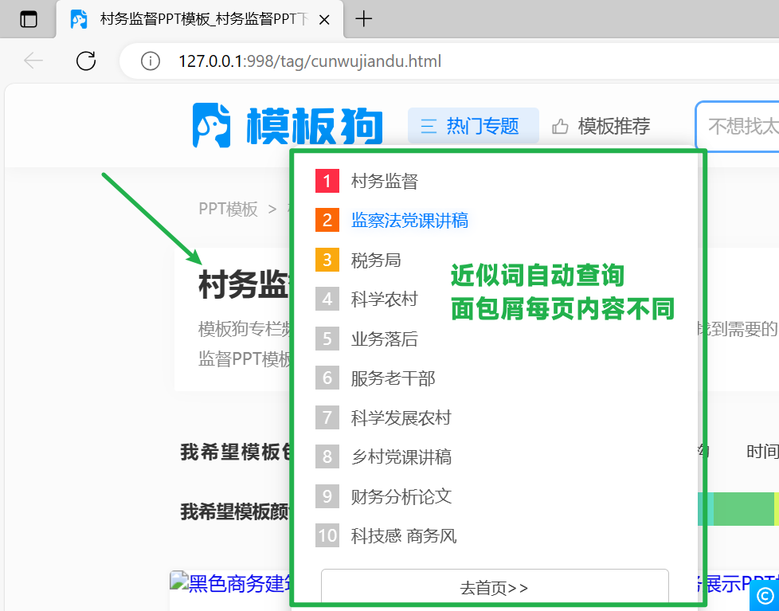

### 标注系统

自动转换PPT为图片和位置信息，支持鼠标点选区域标注，不同元素框线颜色不同

支持根据选择内容**自动推测元素含义**，支持文本提取，**支持常用元素快速标注**

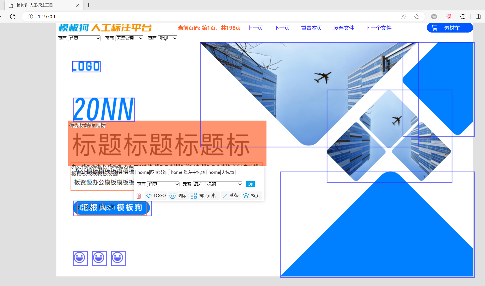

### 小工具

快速拉黑模板小工具

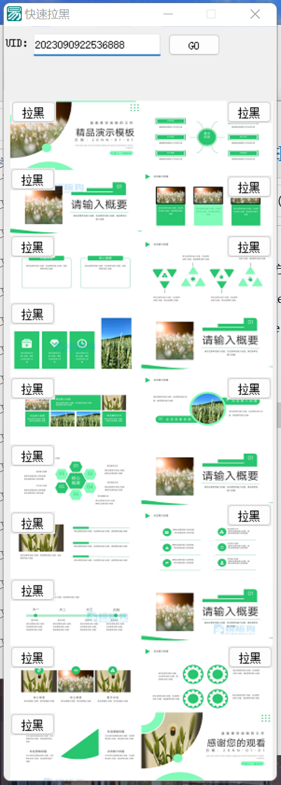

采集同行词库小工具（请遵守robot.txt协议）

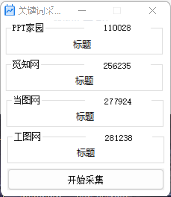

### 微信小程序

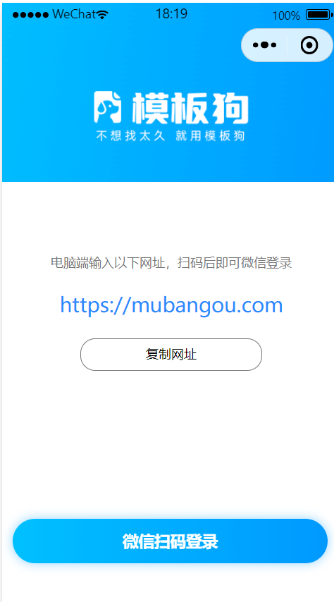

### 用户购买

百度文库渠道上传了几个模板进行测试，目前已经产生购买订单，说明PPT生成质量还算说得过去

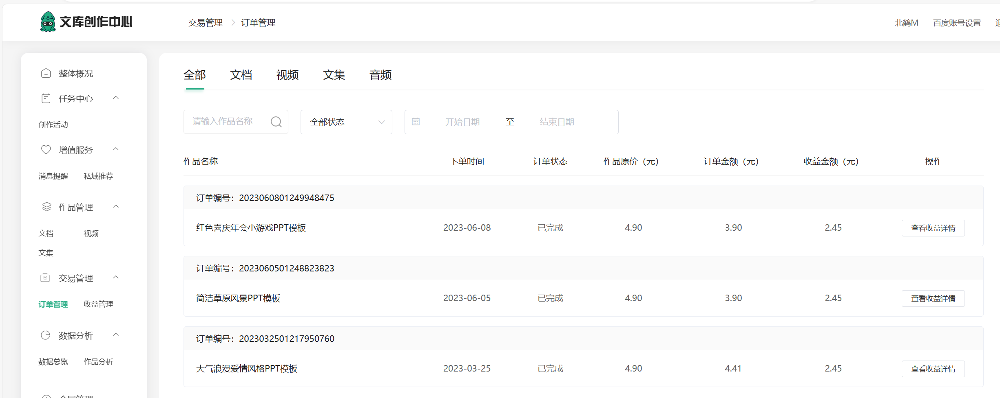

## 目录介绍

### config

一些配置文件

### design-material

项目设计素材，比如使用到的字体、图片、音频等

### exe-gadget

小工具，比如快速拉黑小工具。包含工具和工具源码

### miniprogram

微信小程序代码

### pptbuilder

核心Java代码，SpringBoot程序，run以下就可以

### readme-img

没啥用，readme文档的配图

### sql

MySQL导出文件，您需要将它导入到您自己的MySQL服务器中

### test-file

一些测试文件，方便测试

### web-audits

审核端前端页面

### web-labeling

标注端前端页面

### web-user

用户侧C端前端页面

  

## 搭建准备

您必须有以下开发环境才能完成搭建：

1. 有Java环境，建议版本号：1.8；
2. PHP+Nginx环境，建议版本号：PHP7.3.4 + Nginx1.15.11；
3. MySQL环境，建议版本号：5.7.26，至少2GB的空间；
4. 有ElasticSearch服务，建议版本号：7.17.8；
5. ffmpeg环境，建议版本号：N-109079-g3ab11dc5bb-20221114；
6. Windows服务器或电脑，仅Windows支持PPT转图片和PPT转视频，Linux只能正常生成PPT文件；
7. 【可选】有微信小程序开发工具（支持测试应用模式）；
8. 【可选】支付宝和微信的收款商户账号。

提示：

1. 仅前端用PHP实现（为了利于SEO），其他代码都是Java实现，**PHP本人也是小白，写的比较烂！**

2. 前端已经完全支持多端自适应（无框架纯手撸，真的很好看！）
3. 电脑小工具由于不会.net，所以用易语言写的，可能存在报毒，如果担心请用源码自己编译下再运行（自己编译后360也会报毒，易语言报毒无解！）

## 搭建方法

搭建比较麻烦，涉及多端，请一定不要跳步骤~ 

注意：本项目**不适合新手小白搭建**。

hey bro，这很简单，放青松🌲

1. 将SQL文件夹下的 pptshow.sql 导入到你的MySQL服务中；
2. 注册七牛云账号，记录下你的秘钥；
3. 将config目录下全部文件复制到C盘根目录；
4. 将pptbuilder文件夹用IDEA打开，并将 cc.pptshow.build.pptbuilder.constant.BConstant 修改为你自己的七牛秘钥；
5. 运行PHP客户端，将C端web界面设置好服务端口；
6. 修改PHP代码里面的各种配置项，比如验证码的秘钥、百度审核秘钥、支付秘钥、支付回调等；
7. 修改Java项目的ElasticSearch路径，修改的类是：cc.pptshow.build.pptbuilder.util.EsUtil
8. 修改Java项目的百度秘钥，修改的类是：cc.pptshow.build.pptbuilder.biz.analysis.impl.TitleAnalysisImpl 最后面，请记得开通文本分词功能
9. 启动Java项目，就可以了。

## 一些后门接口

有一些方法都是直接调接口实现的，比如刷数啥的，没有后台可视化点击

很好操作，不用担心哦！

   

## 主要技术

1. 完全原生的Java生成PPT方案，不依赖POI等第三方工具包，不依赖系统，Linux也能生成；
2. PPT自动转图片标注方案，对常见PPT元素进行归类标注；
3. PPT模板调色和层次方案，对页面内元素基于一定算法进行上色和层级排序，保证美观；
4. 自适应、伪静态、SEO友好的前端代码，动态面包屑导航和首位关键词联想单页，实现少量内容大量页面，适合搜索引擎推广；
5. 抓取同行的搜索词方便自己SEO，这个小功能用易语言实现的，如果您不太理解可以自己用Java手撸一个，也很简单；
6. 实现了一个简易的远程Config中心，可以修改配置控制生成参数；
7. 优秀的横向扩展能力，支持多机器同时生成，其他机器进行生图、生视频、视频压缩操作；
8. C端支持了强制绑定手机、用户搜索词合法性过滤（百度审核提供能力）等符合中国大陆地区运营的必要功能。

​     

## 可能存在的潜在收费项

以下收费内容由第三方提供，本系统对接了它们的服务接口。代码未加密您可以自由的修改。

代码接入**不代表我们为您推荐这些服务商**，也不代表LetsPPT对这些服务供应商做出任何保证或背书。

- 云存储服务：七牛云存储
- C端手势验证码服务：vaptcha验证码
- C端短信验证码：vaptcha验证码
- 百度文本审核：用户搜索时会进行文本过滤，避免违禁词展示

## 特别说明

**之前运营使用的域名 mubangou.com 已经出售，目前此网站任何内容与本项目均没有关联！**

  

## 素材版权风险告知

项目所有PPT模板为本人创作，本人是Java开发，曾做过千图网特邀设计师、WPS稻壳签约独家设计师，所以有一定设计基础。模板素材基于CC0协议授权所有人免费商用。

PPT引用的图片素材全部来自CC0素材网站，允许免费商用，请参考CC0相关协议使用。

PPT引用的音频素材全部来自CC0素材网站，允许免费商用，请参考CC0相关协议使用。

C端网站部分素材（如：会员弹窗、前端icon等）可能来自千库网（运营商：上海图魂网络科技有限公司），本人已购买版权，但**您直接使用会存在版权风险**！我们发现可能存在风险的都已经替换或打码并标注，但是可能存在遗漏的，使用前请务必对C端图片版权进行确认以免被要求索赔！

**依照《中华人民共和国著作权法》规定，AI生成内容依法不具有著作权。**
